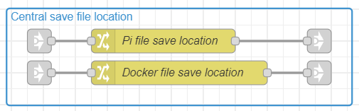
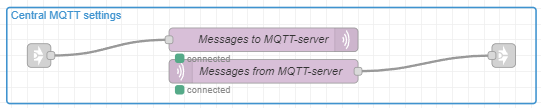

# V1-Shelly-Nodered-flow

To let this flow work correctly, nodered must be version 3.x.x
If not, then the flow will not work.

Which palette modules need to be installed in nodered:
- node-red-dashboard
- node-red-node-ui-table

<a href="https://nodered.org/docs/user-guide/editor/palette/manager">How to install these modules in nodered, click on this link.</a>

The flow saves data on you device. This is needed in case of a deploy or update, to prevent that the config is gone.
The flow tries to make the needed directories, but to help the flow it is better to make these en give the the writting/reading rights  
For the PI with domoticz, make the directory: /home/pi/domoticz/plugins/shelly  
For nodered in docker, make the directory: /data/saved-files/shelly  (remember, that this needs to be a volume, that the config is not gone when something happens with the container)  

Import the flow in your nodred environment.
Copy the JSON flow with, open the next link and copy all data
<a href="https://raw.githubusercontent.com/Hoeby/V1-Shelly-Nodered-flow/main/flows.json">JSON flow data.</a>
Import this data in nodered

When the directories where to config is saved need to be different, these can be changed in the flow.
Search for this part in the flow. Double click on the correct environment and make your changes.
For docker, remember that the location needs to be inside your container, otherwise nodered can't store the config  

There are 2 mqtt nodes in the flow. Set the correct mqtt server in these nodes.
After deploy, check that they are connected

