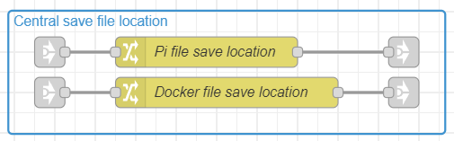
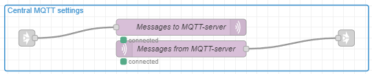
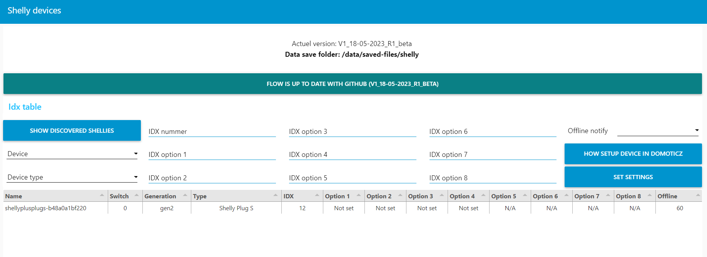

This flow uses prefixed nodes, which needs to be installed in nodered.  
Which palette modules need to be installed in nodered:
- node-red-dashboard
- node-red-node-ui-table

If this is the first time, that you will install prefixed nodes, follow the manual from nodered.  
<a href="https://nodered.org/docs/user-guide/editor/palette/manager">How to install these modules in nodered, click on this link.</a> 

The flow saves data on your device. This is needed in case of a deploy or update, to prevent that the config is gone.  
The flow tries to make the needed directories, but to help the flow it is better to make these en give the the writting/reading rights  
For the PI with domoticz, make the directory: /home/pi/domoticz/plugins/shelly  
For nodered in docker, make the directory: /data/saved-files/shelly  (remember, that this needs to be a volume, that the config is not gone when something happens with the container)  

Import the flow in your nodred environment.
Copy the JSON flow with, open the next link and copy all data  
<a href="https://raw.githubusercontent.com/Hoeby/V1-Shelly-Nodered-flow/main/flows.json">JSON flow data.</a> 
Import this data in nodered  
If this is the first time, that you will import a flow, follow the manual from nodered.  
<a href="https://nodered.org/docs/user-guide/editor/workspace/import-export">How to import/export flows in nodered, click on this link.</a> 

When the directories where to config is saved need to be different, these can be changed in the flow.  
Search for this part in the flow. Double click on the correct environment and make your changes.  
For docker, remember that the location needs to be inside your container, otherwise nodered can't store the config  

There are 2 mqtt nodes in the flow. Set the correct mqtt server in these nodes.  
After deploy, check that they are connected  

Go to you nodered web UI page  
Replace "nodered IP" with the ip address from your environment   
Replace "nodered number" with the port number from your environment  
http://nodered IP:nodered Port/ui  

When correct, you see this page in the web UI  
The flow will test your directory. When correct working, the directory location is shown at the top.   
If it stays on: please wait, loading config  
Then the directory can't be written by nodered. check your directory and writting/reading rights  

To get the devices in the list.  
Switch your shelly plugin (manually or with the shelly app). If your shelly device has the correct mqtt settings, it will send data to mqtt server.  
First click on the button "Show discoved shellies", then it will pop-up in the flow and you can setup the idx numbers/device type.  
To setup the idx settings. Choose the device, select the device type and click on "set settings".  
Click on "How setup device in domoticz", which dummy devices manual need to be made in domoticz. This flow doens't automatically make devices in domoticz  
 
offline notify = if set, then in this time the flow needs to receive a mqtt message from shelly, otherwise it sets values to -1 and switches OFF, this to trigger, that the device is offline 

you are ready to go

<a href="../../README.md">Back to main page</a>
