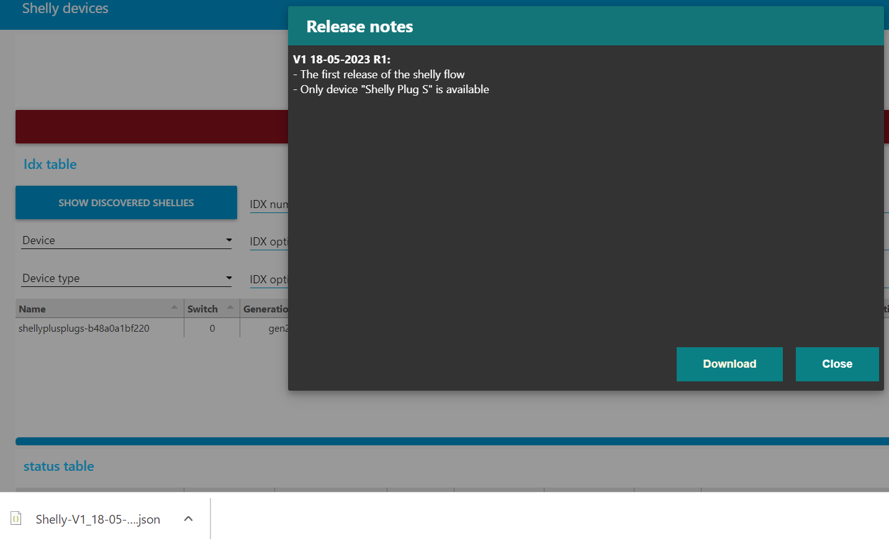

When your flow gives a red bar with the info that there is an update.  
Then you could perform an update, but how?  
  

Before you do an update, read the release notes, if this update makes sense for you.  
To read the release notes, click on the red bar.  
  

If you want to update, click on the "Download" button.  
A .json file will be downloaded. Later we will import this .json file, to execute the update.  
  

Before going to the next steps, first the original flow needs to be disabled.  
The update is not a real update, but importing the new flow. That's why the original flow needs to be disabled, to prevent you have 2 flows which are the same.  
Double click on the flow name  
  

On bottom left, click on "enable", the text will change in "disable"  
Click "done" and then "deploy"  
  

Now import the downloaded .json file  
Select the button "select a file to import" and choose the downloaded .json file  
  

The update (the replaced flow) is done.  
Test the changed flow. If you are happy, then delete the disabled flow.  
If not happy, delete the new imported flow and enable the old flow again.  
